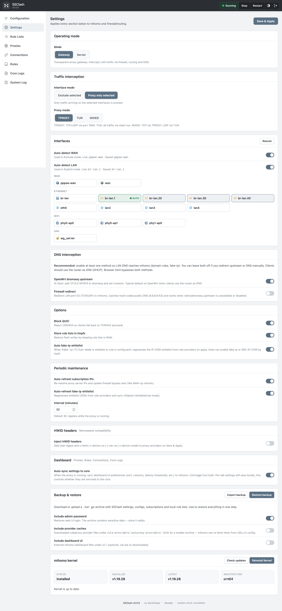
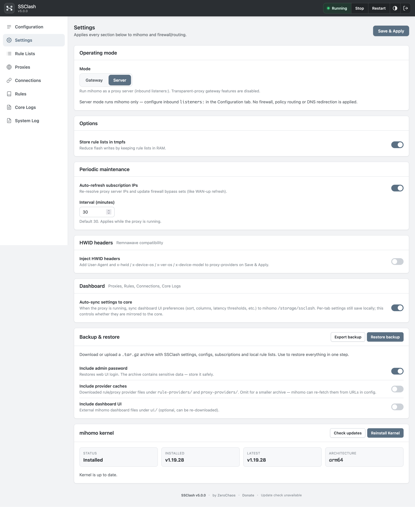
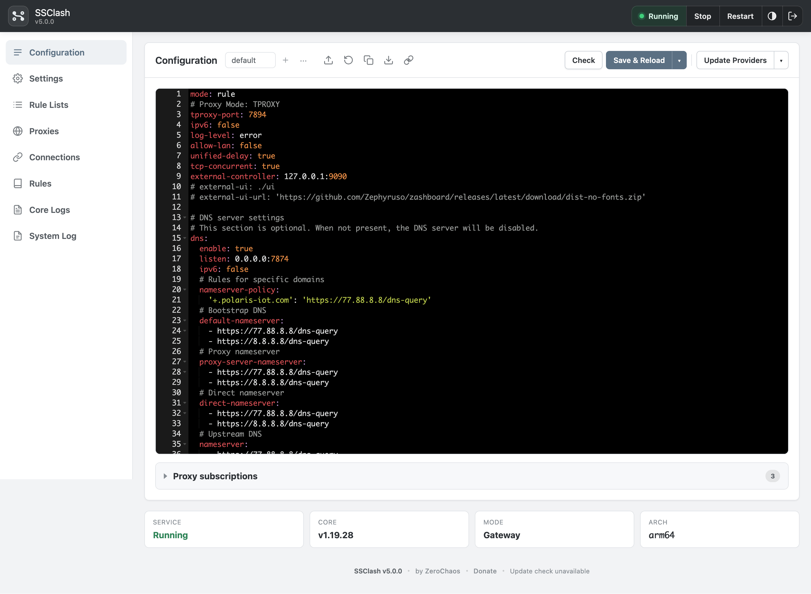
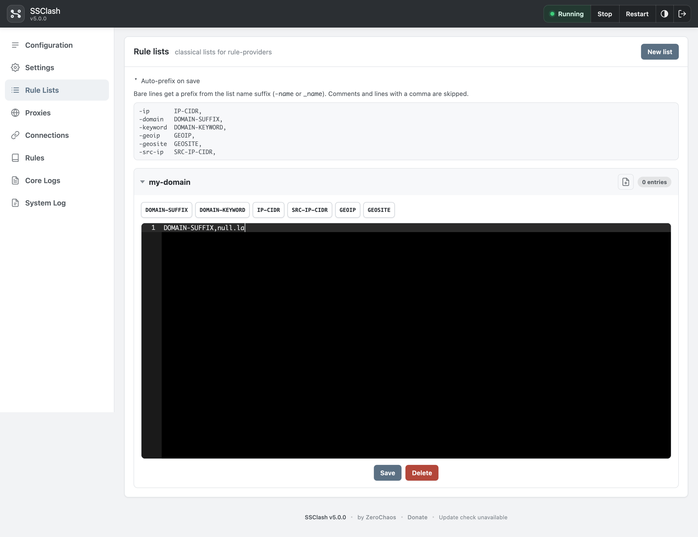
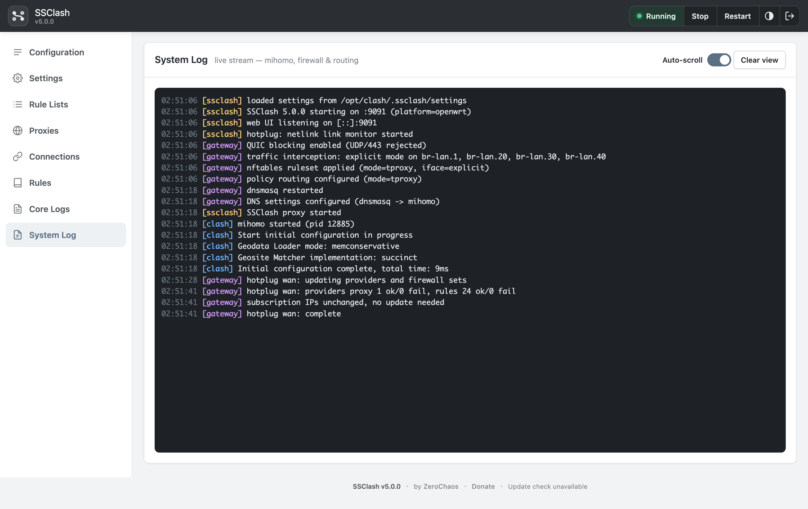
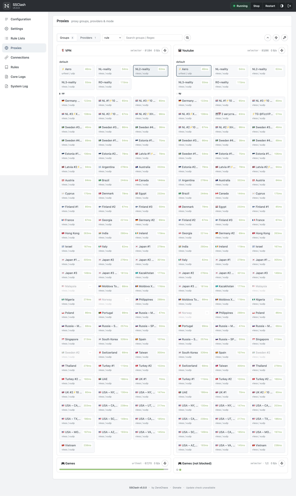
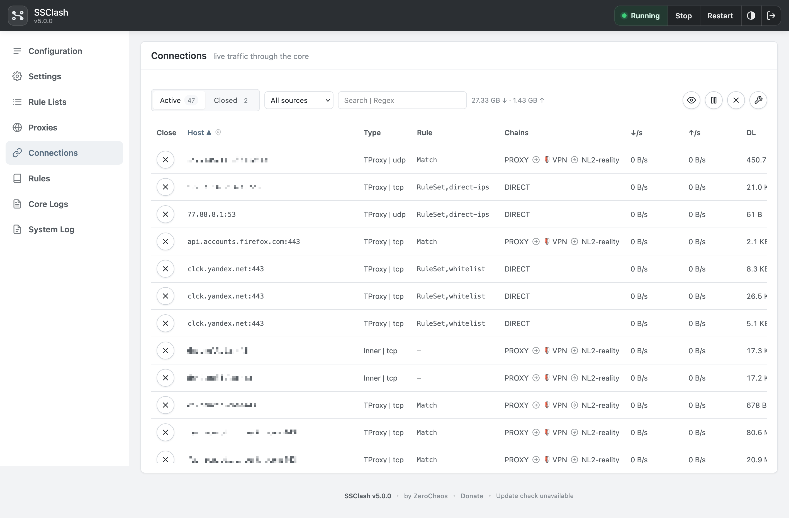
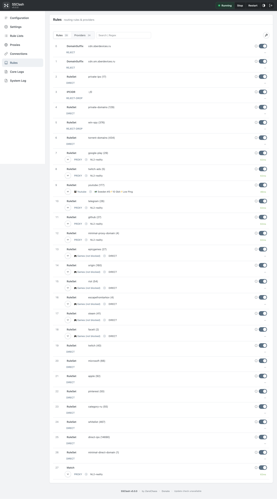
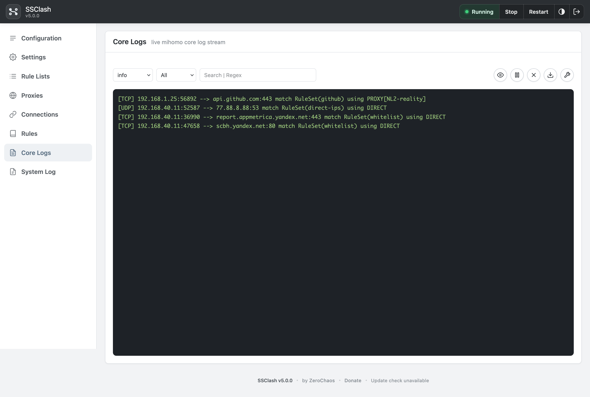

📖 Read this in other languages:
- [Русский](README.ru.md)

<p align="center">
  
</p>

<p align="center"><em>Super Simple Clash — centralized selective bypass with Mihomo (Clash.Meta)</em></p>

<p align="center">Here's the step-by-step process for installing and configuring SSClash on your router or Linux gateway.</p>

This repository is the official distribution of **SSClash** — a self-contained
daemon with an embedded web UI. No LuCI package or OpenWrt SDK is required. It
is the successor to the original
[zerolabnet/SSClash](https://github.com/zerolabnet/SSClash) LuCI application
while keeping the same `/opt/clash` layout and feature set.

## Highlights

- **One binary, every architecture.** Pre-built static binaries for amd64, arm64, armv5/6/7, 386, loong64, riscv64, ppc64le, s390x and mips/mipsle variants. The web UI is embedded in the daemon.
- **Embedded web UI** — **Configuration**, **Settings**, **Rule Lists**, built-in **Proxies / Connections / Rules / Core Logs** dashboard, and **System Log** — with YAML editing, service control, interface/kernel management and live streams.
- **External Mihomo core**, fully managed: download/update from GitHub releases (arch auto-detected), start/stop/restart, `clash -t` validation and hot reload via the Mihomo API.
- **Native firewall engine**: atomic `nft -f -` ruleset (`table inet clash`) or iptables/ipset fallback; **TPROXY / HYBRID / TUN / MIXED / MIXED2** modes; exclude/explicit interface model; QUIC blocking; reserved destination networks; port filter; per-client source bypass; fake-ip whitelist optimisation; subscription server-IP bypass.
- **Policy routing** via `ip rule`/`ip route` (tables `100`/`101`, fwmarks `0x1`/`0x2`/`0x3`).
- **Secure by default**: first-run admin password (PBKDF2-HMAC-SHA256), HMAC session cookies, CSRF protection, optional HTTPS.
- **Platform support**: OpenWrt, generic Linux (systemd), and Keenetic (Entware).

## Directory layout

Everything lives under `/opt/clash` by default (`SSCLASH_ROOT` overrides this):

```
/opt/clash/
├── bin/ssclash          # SSClash daemon
├── bin/clash            # Mihomo kernel
├── config.yaml
├── configs/             # named profiles
├── local-rules/         # user rule lists (was lst/ in LuCI SSClash)
├── rule-providers/      # downloaded rule providers (was ruleset/)
├── proxy-providers/     # downloaded proxy providers (was proxy_providers/)
├── subscriptions/       # pasted link lists (file providers)
├── ui/                  # external dashboard files
├── .ssclash/            # settings, password, session, DNS backups
└── (runtime) /tmp/ssclash/  # caches, tmpfs symlinks, subscription IP cache
```

### Migrating from LuCI SSClash

| LuCI SSClash | SSClash (Go) |
|---|---|
| `lst/` | `local-rules/` |
| `ruleset/` | `rule-providers/` |
| `proxy_providers/` | `proxy-providers/` |
| `settings` at root | `.ssclash/settings` |
| `/tmp/clash/` | `/tmp/ssclash/` |

The Go edition reads the same `config.yaml` and Mihomo kernel path. Rename directories as above if you upgrade in place.

# Setup Guide

## Autoinstall scripts

Each installer fetches the matching release binary, sets up `/opt/clash`, downloads the latest Mihomo kernel, and registers the OS service. Use `--no-mihomo` to skip the kernel download.

**OpenWrt** (run on the router):

```bash
wget -T 30 -qO- https://github.com/zerolabnet/SSClash-Go/raw/refs/heads/main/install-ssclash-go.sh | ash
```

SSClash **stops itself** before upgrade when the service is already running (so GitHub downloads work through transparent proxy and binaries can be replaced safely).

**Generic Linux** (systemd):

```bash
curl -fsSL https://github.com/zerolabnet/SSClash-Go/raw/refs/heads/main/install-ssclash-go.sh | sudo sh
```

**Keenetic** (Entware over SSH as root). Firmware BusyBox `wget` has no HTTPS (often segfaults / `not an http or ftp url`). Install Entware `wget-ssl` first:

```bash
opkg update && opkg install wget-ssl ca-certificates
export PATH="/opt/bin:/opt/sbin:$PATH"
wget -T 30 -qO- https://github.com/zerolabnet/SSClash-Go/raw/refs/heads/main/install-ssclash-go.sh | ash
```

### Install options (all installers)

| Flag | Purpose |
|---|---|
| `--port <n>` | Web UI port (default `9091`, all interfaces) |
| `--bind <ip>` | Bind web UI to this IP (with `--port`) |
| `--addr <host:port>` | Full `SSCLASH_ADDR` (overrides `--port` / `--bind`) |
| `--tls-cert <path>` | TLS certificate (PEM); requires `--tls-key` |
| `--tls-key <path>` | TLS private key (PEM); requires `--tls-cert` |
| `--tls-self-signed` | Generate `$ROOT/.ssclash/tls.{crt,key}` (needs `openssl`) |
| `--mode gateway\|server` | Linux only — gateway (transparent proxy) or server (`listeners:`) |
| `--version <tag>` | Download a specific release tag (default: latest) |
| `--from <path>` | Install a local binary instead of downloading |
| `--no-mihomo` | Skip Mihomo kernel download (all installers) |

Examples:

```bash
wget -qO- https://github.com/zerolabnet/SSClash-Go/raw/refs/heads/main/install-ssclash-go.sh | ash -s -- --port 8443 --tls-self-signed
curl -fsSL https://github.com/zerolabnet/SSClash-Go/raw/refs/heads/main/install-ssclash-go.sh | sudo sh -s -- --from ./ssclash-linux-amd64 --mode gateway
wget -qO- https://github.com/zerolabnet/SSClash-Go/raw/refs/heads/main/install-ssclash-go.sh | ash -s -- --version v1.0.0 --bind 192.168.1.1 --no-mihomo
```

Platform-specific scripts (same behaviour, longer URLs) live under `packaging/{openwrt,linux,keenetic}/`.

## Manual install — OpenWrt

### Step 1: Update package list

For **OpenWrt >= 25** (apk):

```bash
apk update
```

For **OpenWrt < 25** (opkg):

```bash
opkg update
```

### Step 2: Install required packages

When installing from GitHub Releases (not from a feed), install these dependencies manually:

- `kmod-tun` — TUN mode
- `kmod-nft-tproxy` — firewall4 / nftables transparent proxy
- `iptables-mod-tproxy` — firewall3 / iptables (OpenWrt < 22.03)

```bash
# nftables (firewall4) on OpenWrt >= 25:
apk add kmod-tun kmod-nft-tproxy

# nftables on older OpenWrt:
opkg install kmod-tun kmod-nft-tproxy

# iptables (firewall3):
opkg install kmod-tun iptables-mod-tproxy
```

### Step 3: Download and install SSClash

Pick the binary for your architecture from [GitHub Releases](https://github.com/zerolabnet/SSClash-Go/releases):

```bash
mkdir -p /opt/clash/bin
curl -L -o /opt/clash/bin/ssclash \
  https://github.com/zerolabnet/SSClash-Go/releases/download/v1.0.0/ssclash-linux-arm64
chmod +x /opt/clash/bin/ssclash
```

Install the init script from the release tarball:

```bash
curl -L -o /tmp/ssclash-openwrt-service.tar.gz \
  https://github.com/zerolabnet/SSClash-Go/releases/download/v1.0.0/ssclash-openwrt-service.tar.gz
tar -xzf /tmp/ssclash-openwrt-service.tar.gz -C /
/etc/init.d/ssclash enable
/etc/init.d/ssclash start
```

## Manual install — generic Linux

Prerequisites: systemd, `nft` or `iptables`, `ip`.

```bash
curl -fsSL https://github.com/zerolabnet/SSClash-Go/raw/refs/heads/main/install-ssclash-go.sh | sudo sh -s -- --from ./ssclash-linux-amd64 --mode gateway
```

Gateway mode applies firewall, policy routing and DNS redirect when you press **Start**. Server mode runs Mihomo only (`listeners:` in Configuration).

## Manual install — Keenetic

Install Entware on USB first. Enable **Open packages**, **Ext file system**, **Netfilter kernel modules** in Keenetic web UI → Components (reboot after enabling Netfilter — kernel `xt_TPROXY` / netfilter support; this does **not** always install a userspace `iptables` binary). SSClash needs an **xtables** userspace CLI: firmware `/sbin/iptables` when present, otherwise the installer runs `opkg install iptables-legacy` or `opkg install iptables` (either is fine if `iptables -V` does not say `nf_tables`). NDMS is **not** a TPROXY API: it rebuilds `filter`/`nat`/`mangle` and drops jumps into custom chains. The supported integration is Keenetic's official [`/opt/etc/ndm/netfilter.d`](https://support.keenetic.com/hero/kn-1012/en/42407-opkg-component-description.html) hook, which restores those jumps with the resolved xtables `iptables` binary (24-second timeout — the hook does not re-run a full Apply).

Policy routing needs the full iproute2 binary; BusyBox's `ip` applet is often
built without `rule` support. The installer runs `opkg install ip-full` when `ip rule` fails.

```bash
opkg update && opkg install wget-ssl ca-certificates
export PATH="/opt/bin:/opt/sbin:$PATH"
wget -qO- https://github.com/zerolabnet/SSClash-Go/raw/refs/heads/main/install-ssclash-go.sh | ash
```

Default: **HYBRID** + Exclude mode, **Auto fake-ip whitelist** enabled. NAT is handled by KeeneticOS.
DNS interception defaults to **Firewall redirect** in Settings (LAN port 53 → Mihomo).
Clients should use the router as DNS (Keenetic DHCP).

KeeneticOS rebuilds netfilter on configuration save, WAN reconnect and component
changes, which drops the jumps into the SSClash chains. Start installs an NDMS
hook at `/opt/etc/ndm/netfilter.d/50-ssclash.sh` that re-inserts `PREROUTING -j CLASH`
(and DNS/QUIC rules) with the resolved xtables `iptables` binary. A full daemon reload runs only if the
custom chains themselves are gone. Stop removes the hook.

**Firewall backend on Keenetic** is fixed to **iptables** (xtables userspace, not nftables). Settings
does not offer Auto or nftables. The installer seeds `FIREWALL_BACKEND=iptables`;
Save/API normalize any other value to iptables. Auto would also resolve to iptables
at runtime, but forced nft is refused at Apply. Entware builds whose `iptables -V` reports `nf_tables`
cannot intercept Keenetic LAN forwarding — use xtables instead (`/sbin/iptables`, `iptables-legacy`, or
Entware `iptables` when it is xtables). The installer runs `opkg install iptables-legacy` or
`opkg install iptables` when no suitable CLI exists. **Netfilter subsystem kernel modules** (Components)
are still required for kernel support (`xt_TPROXY`, …). In **TUN** mode Mihomo starts with `DISABLE_NFTABLES=1` so its
`auto-redirect` uses iptables too (same reason as SSClash).

**Recommended proxy modes on Keenetic (in order):** **HYBRID** (installer default — SSClash
nat DNAT + TPROXY, all Options features, works with router HTTPS on 443), **MIXED2**
(TCP like HYBRID, UDP via `clash-tun` — better QUIC/UDP, no TCP 443 TPROXY issue),
**TPROXY** (if you move router management HTTPS off TCP 443, e.g. 8443), **TUN** last
(Mihomo auto-route/redirect — SSClash bypass/policy Options are limited).
**MIXED** (TCP TPROXY + UDP TUN) inherits the Keenetic TCP `:443` TPROXY limitation;
rarely useful here — prefer **HYBRID** or **MIXED2**.

**Keenetic access policy (HYBRID / TPROXY / MIXED / MIXED2):** Settings → **Respect Keenetic access
policy** — select policies from the router (Internet → Connection Policies). SSClash matches
NDMS connmarks in firewall rules so only devices assigned to those policies enter the
proxy path. Unavailable in **TUN** (Mihomo owns capture there).

**TPROXY on Keenetic and TCP 443:** KeeneticOS uses port 443 internally for `xt_TPROXY`;
LAN TCP to `:443` often never reaches SSClash (TPROXY counters stay at zero). Use **HYBRID**
(default), move router management HTTPS off TCP 443 in the Keenetic web UI (any port
except 443, e.g. 8443), or use **TUN**.

**Keenetic TUN vs OpenWrt/Linux TUN:** on Keenetic, pure TUN uses Mihomo
`auto-route` / `auto-redirect` (not SSClash MARK→`clash-tun`). The synced `tun:` block
includes `strict-route: true` and `dns-hijack: []` — strict routing for gateway capture;
empty DNS hijack so LAN DNS stays on SSClash **Firewall redirect** (`:53` → Mihomo),
not a second hijack inside Mihomo. In **Connections**, TCP may show **Redir | tcp** — that
is Mihomo `auto-redirect`, not HYBRID `redir-port`.

## Proxy modes (Settings)

| Mode | Capture | `config.yaml` (synced on Save / Start) | Notes |
|---|---|---|---|
| **TPROXY** | SSClash mangle TPROXY `:7894` | `tproxy-port: 7894` | Default on OpenWrt/Linux |
| **HYBRID** | TCP nat DNAT → `:7893`, UDP TPROXY `:7894` | `redir-port: 7893`, `tproxy-port: 7894` | Default on Keenetic; full Options |
| **TUN** | OpenWrt/Linux: MARK → `clash-tun`. Keenetic: Mihomo auto-route/redirect | `tun:` block (platform-specific) | TUN stack in Settings (tun/mixed) |
| **MIXED** | TCP TPROXY, UDP MARK → `clash-tun` | `tproxy-port: 7894` + `tun:` | On Keenetic: TCP `:443` TPROXY issue; prefer HYBRID/MIXED2 |
| **MIXED2** | TCP nat DNAT → `:7893`, UDP MARK → `clash-tun` | `redir-port: 7893` + `tun:` (no `tproxy-port`) | HYBRID TCP path + MIXED UDP path; full Options on Keenetic |

When **Save** in Settings changes proxy mode or TUN stack, SSClash rewrites the active
`config.yaml` profile if it disagrees (same ports/blocks as the table above), validates
with `clash -t`, then restarts Mihomo when the service is running.

## Step 4: Mihomo kernel management

The autoinstall scripts download the latest Mihomo kernel automatically. You can also manage it from the web UI or install manually (see below).

From the web UI, go to **Settings** → **Mihomo kernel** and click **Download latest kernel**. SSClash will:

- Detect your device architecture
- Download the latest compatible Mihomo release
- Install it to `/opt/clash/bin/clash`
- Show kernel status and version

**Important:** Restart the Clash service after a fresh kernel install.

### Manual kernel installation (optional)

```bash
cd /opt/clash/bin
curl -L -o clash.gz \
  https://github.com/MetaCubeX/mihomo/releases/download/v1.19.29/mihomo-linux-arm64-v1.19.29.gz
gunzip clash.gz && chmod +x clash
```

See the [Mihomo releases page](https://github.com/MetaCubeX/mihomo/releases) for other architectures.

## Step 5: Configure interface processing mode

SSClash offers two interface processing modes:

### Explicit mode (recommended)

- Processes traffic **only** on selected interfaces — nothing else reaches Mihomo at the firewall level
- Best when you want tight control over which LAN/VLAN or clients enter the proxy path
- Often combined with fake-ip whitelist and `SRC-IP-CIDR` rules in `config.yaml` (see Step 7)

### Exclude mode (simple default)

- Proxies **all** traffic except interfaces you pick (typically WAN)
- Easiest whole-LAN setup if you do not need per-interface split
- Which destinations are proxied is still decided by Mihomo rules in `config.yaml`

### Additional settings

- **Block QUIC traffic** — blocks UDP/443 to improve proxy effectiveness (YouTube, etc.)
- **Reserved networks (firewall)** — destination IPv4 CIDRs that skip transparent-proxy marking (Settings → Options). Defaults include RFC special-use ranges and CGNAT `100.64.0.0/10` (Tailscale/Headscale); remove that prefix if Tailnet should go through Mihomo. Mihomo `private-ips` rules are separate. Hidden in UI on **Keenetic TUN**.
- **Port filter (firewall)** — destination TCP/UDP ports handled in netfilter *before* Mihomo (Settings → Options). **Bypass** never enters the core (e.g. fixed BitTorrent listen ports). **Proxy-only** (when non-empty) marks only listed ports — useful on weak routers so random torrent peers never enter the core. Empty lists keep the previous “all ports” behaviour. This is not the same as Mihomo `DST-PORT` rules. Hidden in UI on **Keenetic TUN** (Mihomo capture bypasses SSClash port filter).
- **Bypass clients (firewall)** — source IPv4 CIDRs that skip transparent-proxy marking *and* DNS redirect, so those LAN hosts never enter Mihomo (Settings → Options). Not `config.yaml` `SRC-IP-CIDR` (that still sends packets into the core). Empty = off. With fake-ip, set a real DNS on the device; on OpenWrt dnsmasq upstream is global, so bypassing DNS redirect there does not help — use a public DNS on the bypassed client. On **Keenetic TUN**, bypass skips DNS redirect and QUIC block only — Mihomo auto-route still captures IP traffic; use `SRC-IP-CIDR` in `config.yaml` or switch to HYBRID/MIXED2/TPROXY for SSClash-native per-client control.
- **Store rules and proxy providers in RAM** — symlinks `rule-providers/` and `proxy-providers/` to tmpfs to reduce NAND wear
- **Add HWID headers to subscriptions** — Remnawave-compatible 16-character HWID on proxy-provider requests (also used when fetching a remote full config URL)
- **Backup / restore** — export or import `.ssclash/` settings and lists from the Settings page
- **Web UI port and TLS** — set via install flags or `SSCLASH_ADDR` / `SSCLASH_TLS_*` in the init script or systemd unit

<p align="center">
  
</p>

<p align="center">
  
</p>

## Step 6: Clash configuration management

Edit `config.yaml` in the built-in ACE editor:

- **Syntax highlighting** for YAML
- **Live service control** — Start / Stop / Restart in the toolbar
- **Named profiles** — save and switch configs under `configs/`
- **Load from URL** (optional) — download a full Mihomo YAML into profile `remote` (Remnawave `/sub/{token}` falls back to `/mihomo`). Auto-update can follow the provider’s `Profile-Update-Interval` or a fixed custom interval (1–168h); **Save settings** changes URL/auto/interval without re-downloading; **Stop remote source** clears the subscription while keeping profile `remote` as a local copy. Independent of proxy-provider refresh. Empty URL keeps local-only behaviour.
- **Subscription disable/enable** — comment out proxy-provider blocks without deleting them
- **Open Dashboard** — opens the Mihomo external UI (see Step 9)

<p align="center">
  
</p>

## Step 7: Local rulesets management

Create and manage local rule files for `rule-providers`:

- **Create custom rule lists** with validation
- **Fake-IP whitelist** (`local-rules/fakeip-whitelist-ipcidr.txt`) — destination IPv4/CIDR list for `fake-ip-filter-mode: whitelist` or `rule`. With **Auto fake-ip whitelist** (Settings), the AUTO block is rebuilt on Start/apply from:
  - inline `IP-CIDR` rules in `rules:` with a non-DIRECT action (e.g. `PROXY`, a proxy-group name)
  - IP-CIDR entries in rule-providers referenced by non-DIRECT `RULE-SET` rules
  - `dns.fake-ip-filter` entries (per filter mode)
  - `SRC-IP-CIDR` is **not** copied into this file — it is handled separately by the firewall for per-client source matching
- Use **Regenerate** on the Rule Lists tab after editing rules, or **Save & Reload** / **Start** while auto-sync is enabled
- Organized file management with collapsible sections

<p align="center">
  
</p>

## Step 8: Real-time log monitoring

Monitor activity in **System Log**:

- **Live SSE stream** with automatic updates
- **Color-coded sources** — `clash` (Mihomo), `gateway` (firewall/routing/DNS), `ssclash` (daemon/UI)
- Filter by source and search text
- Auto-scroll to latest entries

<p align="center">
  
</p>

## Step 9: Mihomo dashboard

SSClash includes a built-in dashboard with four tabs — **Proxies**, **Connections**, **Rules**, and **Core Logs** — in the same UI style as the rest of the app. The browser talks to `/api/mihomo/*`; the Mihomo `secret` and external controller stay on the server.

**System Log** (sidebar) is separate: it shows SSClash daemon, firewall, and routing messages. **Core Logs** shows the live Mihomo core log stream.

Dashboard preferences are stored under `config/*` and `cache/*` keys in the browser's `localStorage`, with optional sync to Mihomo via the core `/storage` slot when **Auto-sync settings** is enabled in the Proxies tab settings. This is separate from Mihomo's `cache.db` file (core profile data such as fake-ip mappings).

Optionally, set `external-ui` in `config.yaml` and install a third-party bundle under `ui/`. When `external-ui` is configured, **Open Dashboard** on the Configuration page opens that external UI in a new tab.

<p align="center">
  
</p>

<p align="center">
  
</p>

<p align="center">
  
</p>

<p align="center">
  
</p>

## First run

1. Open `http://<host>:9091` (or your `--port` / `--bind` / TLS URL) and set the admin password.
2. Edit **Configuration** — a sensible default is seeded on first start. Add proxies or a subscription.
3. Press **Start** in the header.

The installer downloads Mihomo automatically. If it was skipped (`--no-mihomo`) or the download failed, get the kernel from **Settings → Mihomo kernel** before **Start**.

## Environment variables

| Variable | Default | Purpose |
|---|---|---|
| `SSCLASH_ROOT` | `/opt/clash` | Working directory (config, kernel, lists) |
| `SSCLASH_TMP` | `/tmp/ssclash` | Runtime temp dir (caches, tmpfs symlinks) |
| `SSCLASH_PLATFORM` | auto | Force `openwrt`, `keenetic`, or `linux` |
| `SSCLASH_ADDR` | `:9091` | Web UI listen address |
| `SSCLASH_SECRET` | auto | Session signing secret (persisted otherwise) |
| `SSCLASH_TLS_CERT` / `SSCLASH_TLS_KEY` | — | Enable HTTPS for the web UI |
| `SSCLASH_DEBUG` | `0` | `1` — verbose boot diagnostics on stderr; extra gateway warnings. Full iptables counter dump: `ssclash fw diagnose` |
| `SSCLASH_BRAND` | `SSClash` | Product name in the authenticated UI |
| `SSCLASH_LOGIN_TITLE` | — | Optional brand on login/setup screens |

## CLI

```
ssclash [serve]              run the daemon + web UI (default)
ssclash fw start|stop|update apply / remove / refresh firewall + routing
ssclash fw diagnose          log intercept wiring, policies, iptables counters (troubleshooting)
ssclash fw ndm-reload        restore SSClash jumps after KeeneticOS netfilter rebuild
ssclash hotplug wan|tun      run WAN-up or TUN-add handlers (manual / cron)
ssclash cleanup              remove orphan Mihomo + firewall after unclean stop
ssclash setpass [password]   set the web admin password
ssclash version              print version
```

## Key constants

These must stay aligned with `config.yaml` (ports, marks, table IDs):

TPROXY port `7894`, HYBRID TCP redirect port `7893` (`redir-port`), DNS `7874`, external-controller `:9090`, fwmarks `0x1`/`0x2`/`0x3`, routing tables `100`/`101`, rule prefs `1000`/`1001`, nft table `inet clash`, TUN device `clash-tun`, default fake-ip range `198.18.0.0/15`.

## Release binaries

Each [GitHub Release](https://github.com/zerolabnet/SSClash-Go/releases) includes:

| Asset | Description |
|---|---|
| `ssclash-linux-amd64`, `ssclash-linux-arm64`, … | Static daemon (16 Linux targets) |
| `ssclash-openwrt-service.tar.gz` | OpenWrt `init.d` service files |
| `ssclash-keenetic-service.tar.gz` | Keenetic Entware `S99ssclash` init script |
| `sha256sums.txt` | SHA-256 checksums |

## Uninstall

**OpenWrt:**

```bash
/etc/init.d/ssclash stop
/etc/init.d/ssclash disable
rm -f /etc/init.d/ssclash
rm -rf /opt/clash
```

**Linux (systemd):**

```bash
sudo systemctl stop ssclash
sudo systemctl disable ssclash
sudo rm -f /etc/systemd/system/ssclash.service
sudo rm -rf /opt/clash
```

**Keenetic:**

```bash
/opt/etc/init.d/S99ssclash stop
rm -f /opt/etc/init.d/S99ssclash
rm -f /opt/etc/ndm/netfilter.d/50-ssclash.sh
rm -rf /opt/clash
```

## License

SSClash binaries and install scripts in this repository are distributed under the
[SSClash Binary Software License](LICENSE) (proprietary).

The optional **Mihomo** core is a separate third-party component with its own
license. See [THIRD_PARTY_NOTICES.md](THIRD_PARTY_NOTICES.md).

## Support

If SSClash is useful to you, consider [donating](https://zerolab.net/donate/) to support development by [ZeroChaos](https://zerolab.net).
