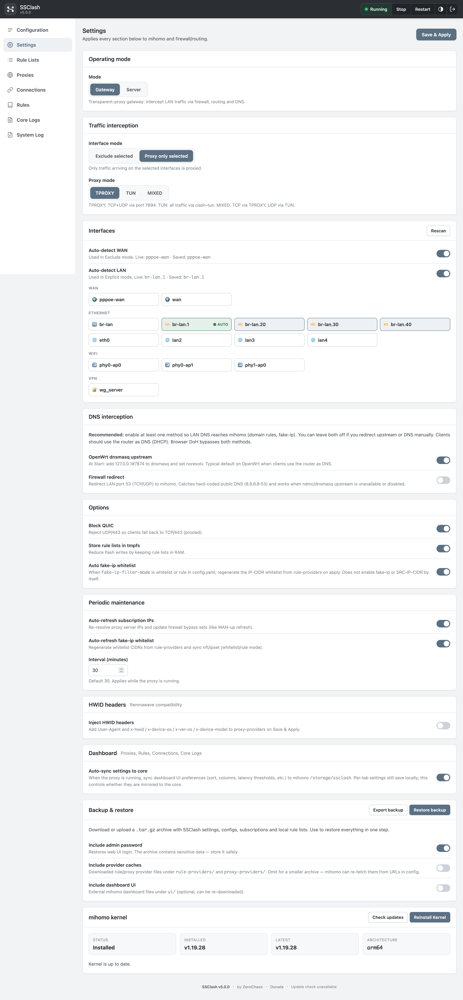
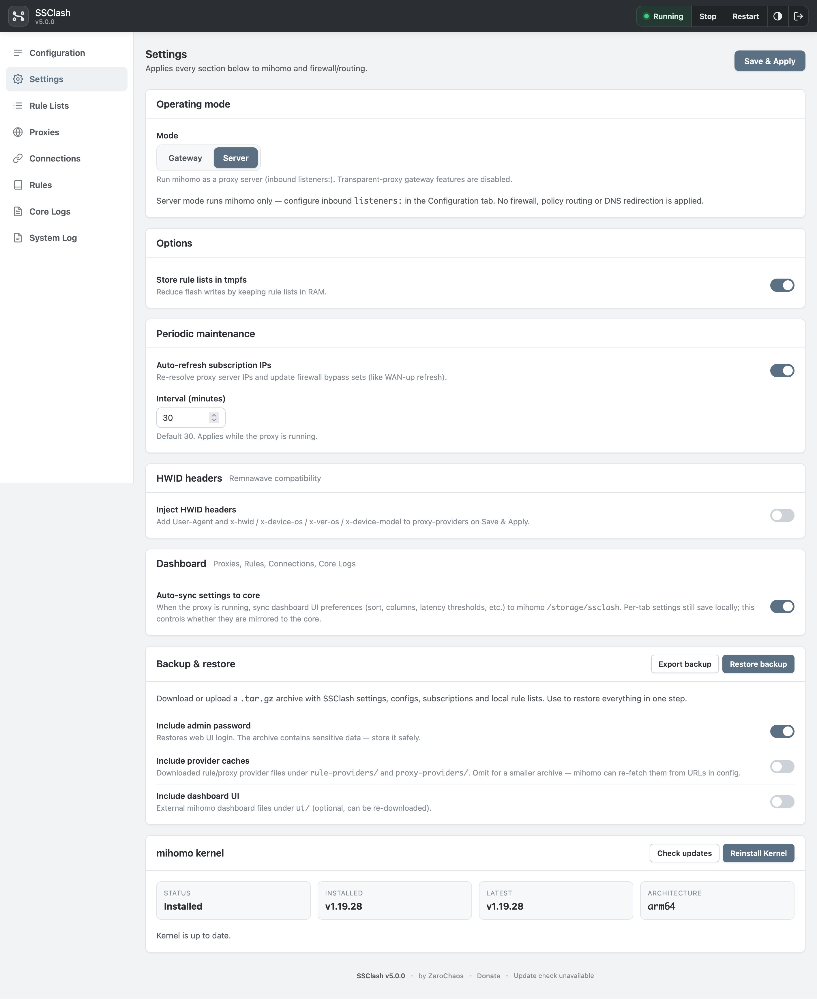
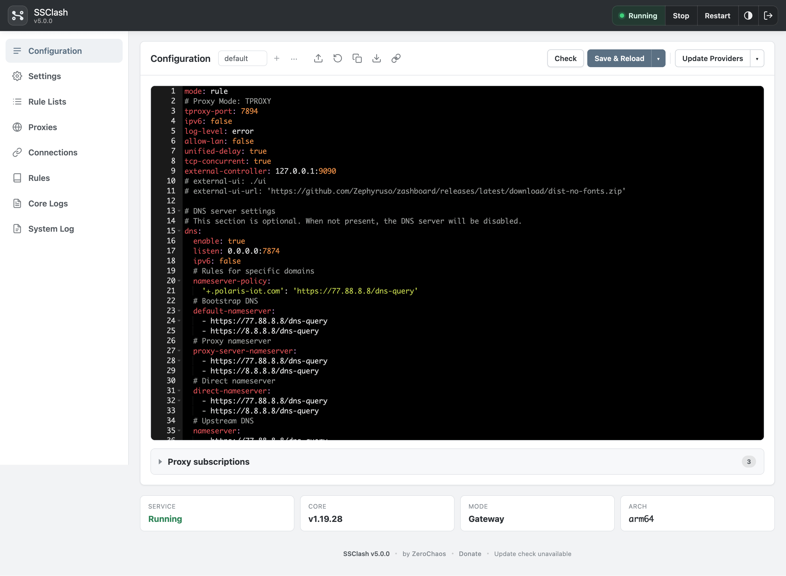
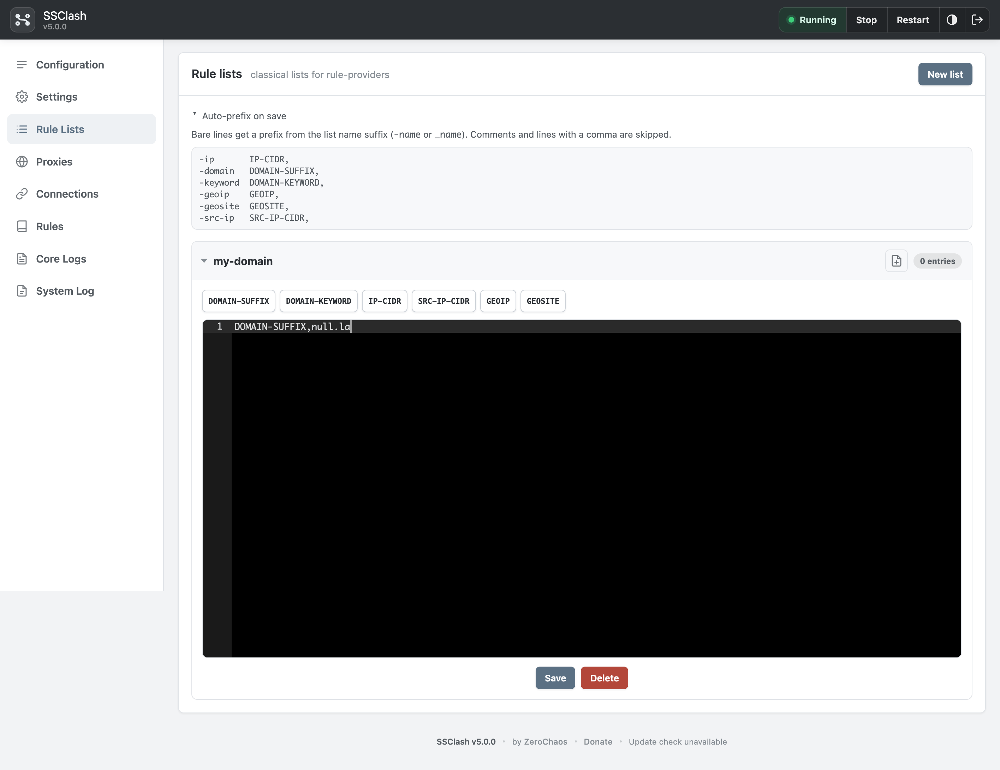
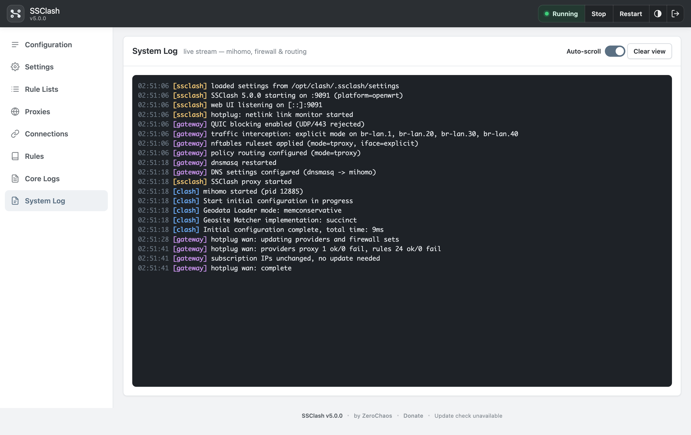
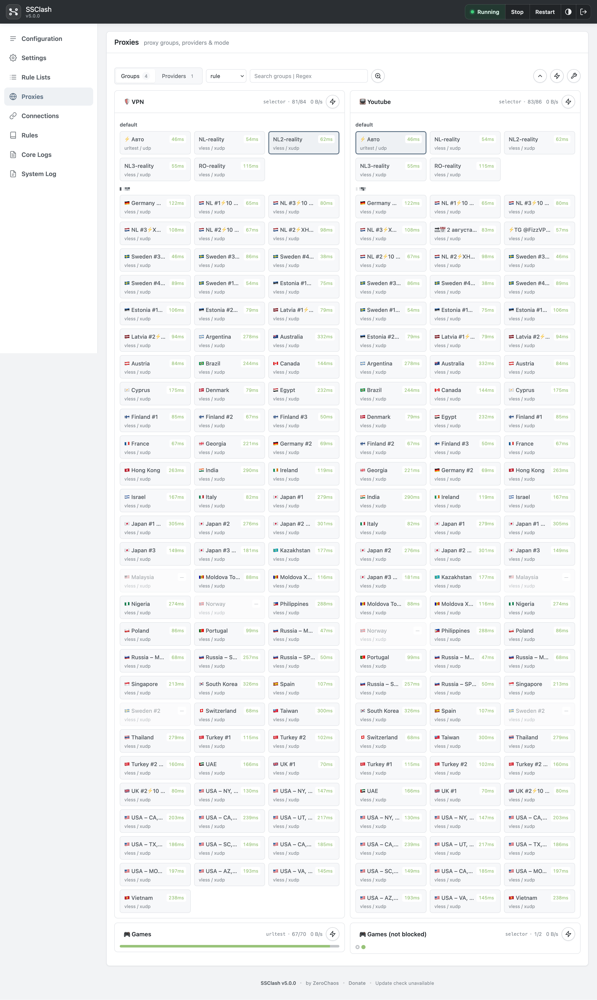
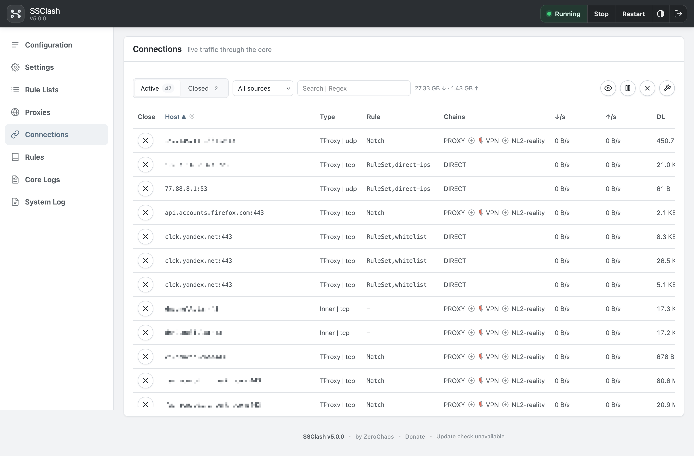
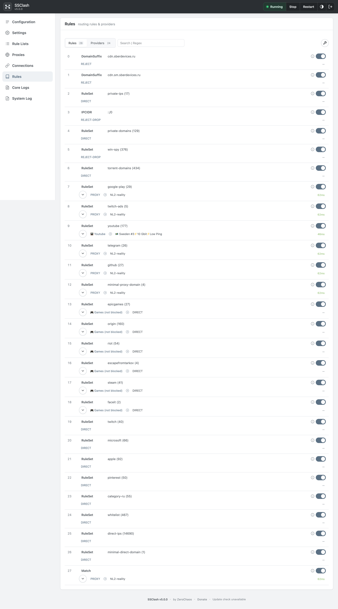
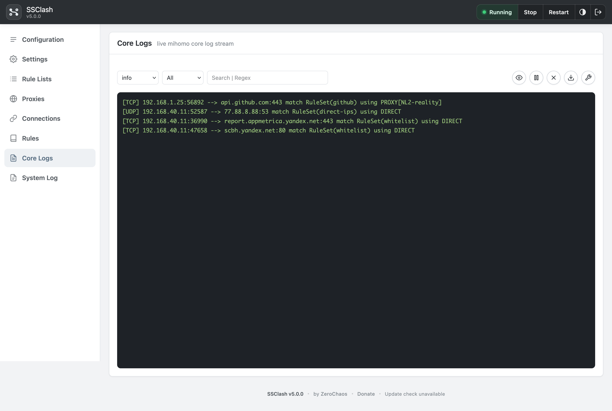

📖 Читать на других языках:
- [English](README.md)

<p align="center">
  
</p>

<p align="center"><em>Super Simple Clash — централизованный выборочный обход с Mihomo (Clash.Meta)</em></p>

<p align="center">Пошаговая инструкция по установке и настройке SSClash на роутере или Linux-шлюзе.</p>

Этот репозиторий — официальный дистрибутив **SSClash**: самодостаточный демон
со встроенным веб-интерфейсом. Пакет LuCI и OpenWrt SDK не нужны. Это преемник
оригинального LuCI-приложения
[zerolabnet/SSClash](https://github.com/zerolabnet/SSClash) с тем же каталогом
`/opt/clash` и набором функций.

## Основные возможности

- **Один бинарник, все архитектуры.** Готовые статические бинарники для amd64, arm64, armv5/6/7, 386, loong64, riscv64, ppc64le, s390x и вариантов mips/mipsle. Веб-интерфейс встроен в демон.
- **Встроенный веб-UI** — **Конфигурация**, **Настройки**, **Списки правил**, встроенная панель **Proxies / Connections / Rules / Core Logs** и **Системный лог** — редактирование YAML, управление службой, интерфейсами/ядром и потоки в реальном времени.
- **Внешнее ядро Mihomo**, полностью управляемое демоном: загрузка/обновление с GitHub Releases (архитектура определяется автоматически), запуск/остановка/перезапуск, проверка `clash -t` и горячая перезагрузка через API Mihomo.
- **Собственный движок файрвола**: атомарный ruleset `nft -f -` (`table inet clash`) или fallback iptables/ipset; режимы **TPROXY / TUN / MIXED**; модели exclude/explicit; блокировка QUIC; оптимизация fake-ip whitelist; обход IP серверов подписок.
- **Policy routing** через `ip rule`/`ip route` (таблицы `100`/`101`, метки `0x1`/`0x2`/`0x3`).
- **Безопасность по умолчанию**: пароль администратора при первом запуске (PBKDF2-HMAC-SHA256), HMAC-сессии, защита CSRF, опциональный HTTPS.
- **Платформы**: OpenWrt и обычный Linux (systemd). Keenetic (Entware) поддерживается, но **автором не тестировался**.

## Структура каталогов

По умолчанию всё находится в `/opt/clash` (переопределяется через `SSCLASH_ROOT`):

```
/opt/clash/
├── bin/ssclash          # демон SSClash
├── bin/clash            # ядро Mihomo
├── config.yaml
├── configs/             # именованные профили
├── local-rules/         # локальные списки правил (было lst/ в LuCI SSClash)
├── rule-providers/      # загруженные rule-providers (было ruleset/)
├── proxy-providers/     # загруженные proxy-providers (было proxy_providers/)
├── subscriptions/       # вставленные списки ссылок (file providers)
├── ui/                  # файлы внешней панели
├── .ssclash/            # настройки, пароль, сессия, резервные копии DNS
└── (runtime) /tmp/ssclash/  # кэши, tmpfs-симлинки, кэш IP подписок
```

### Миграция с LuCI SSClash

| LuCI SSClash | SSClash (Go) |
|---|---|
| `lst/` | `local-rules/` |
| `ruleset/` | `rule-providers/` |
| `proxy_providers/` | `proxy-providers/` |
| `settings` в корне | `.ssclash/settings` |
| `/tmp/clash/` | `/tmp/ssclash/` |

Go-версия использует тот же `config.yaml` и путь к ядру Mihomo. При обновлении на месте переименуйте каталоги по таблице выше.

# Руководство по установке

## Скрипты автоустановки

Каждый установщик загружает бинарник SSClash, настраивает `/opt/clash`, скачивает последнее ядро Mihomo и регистрирует службу ОС. Флаг `--no-mihomo` пропускает загрузку ядра.

**OpenWrt** (на роутере):

```bash
wget -T 30 -qO- https://github.com/zerolabnet/SSClash-Go/raw/refs/heads/main/install-ssclash-go.sh | ash
```

Перед обновлением установщик **сам останавливает** ssclash, если служба уже запущена (чтобы скачивание с GitHub не ломалось из‑за прозрачного прокси и чтобы можно было безопасно заменить бинарники).

**Обычный Linux** (systemd):

```bash
curl -fsSL https://github.com/zerolabnet/SSClash-Go/raw/refs/heads/main/install-ssclash-go.sh | sudo sh
```

**Keenetic** (Entware по SSH от root):

```bash
wget -T 30 -qO- https://github.com/zerolabnet/SSClash-Go/raw/refs/heads/main/install-ssclash-go.sh | ash
```

### Параметры установки (все установщики)

| Флаг | Назначение |
|---|---|
| `--port <n>` | Порт веб-UI (по умолчанию `9091`, все интерфейсы) |
| `--bind <ip>` | Привязка веб-UI к IP (вместе с `--port`) |
| `--addr <host:port>` | Полный `SSCLASH_ADDR` (перекрывает `--port` / `--bind`) |
| `--tls-cert <path>` | TLS-сертификат (PEM); требует `--tls-key` |
| `--tls-key <path>` | TLS-ключ (PEM); требует `--tls-cert` |
| `--tls-self-signed` | Сгенерировать `$ROOT/.ssclash/tls.{crt,key}` (нужен `openssl`) |
| `--mode gateway\|server` | Только Linux — шлюз (прозрачный прокси) или сервер (`listeners:`) |
| `--version <tag>` | Скачать конкретный релиз (по умолчанию: latest) |
| `--from <path>` | Установить локальный бинарник вместо загрузки |
| `--no-mihomo` | Пропустить загрузку ядра Mihomo (все установщики) |

Примеры:

```bash
wget -qO- https://github.com/zerolabnet/SSClash-Go/raw/refs/heads/main/install-ssclash-go.sh | ash -s -- --port 8443 --tls-self-signed
curl -fsSL https://github.com/zerolabnet/SSClash-Go/raw/refs/heads/main/install-ssclash-go.sh | sudo sh -s -- --from ./ssclash-linux-amd64 --mode gateway
wget -qO- https://github.com/zerolabnet/SSClash-Go/raw/refs/heads/main/install-ssclash-go.sh | ash -s -- --version v1.0.0 --bind 192.168.1.1 --no-mihomo
```

Платформенные скрипты (то же поведение, длинные URL) — в `packaging/{openwrt,linux,keenetic}/`.

## Ручная установка — OpenWrt

### Шаг 1: Обновление списка пакетов

Для **OpenWrt >= 25** (apk):

```bash
apk update
```

Для **OpenWrt < 25** (opkg):

```bash
opkg update
```

### Шаг 2: Установка необходимых пакетов

При установке из GitHub Releases (не из feed) зависимости ставятся вручную:

- `kmod-tun` — режим TUN
- `kmod-nft-tproxy` — прозрачный прокси для firewall4 / nftables
- `iptables-mod-tproxy` — firewall3 / iptables (OpenWrt < 22.03)

```bash
# nftables (firewall4) на OpenWrt >= 25:
apk add kmod-tun kmod-nft-tproxy

# nftables на старых OpenWrt:
opkg install kmod-tun kmod-nft-tproxy

# iptables (firewall3):
opkg install kmod-tun iptables-mod-tproxy
```

### Шаг 3: Загрузка и установка SSClash

Выберите бинарник для вашей архитектуры в [GitHub Releases](https://github.com/zerolabnet/SSClash-Go/releases):

```bash
mkdir -p /opt/clash/bin
curl -L -o /opt/clash/bin/ssclash \
  https://github.com/zerolabnet/SSClash-Go/releases/download/v1.0.0/ssclash-linux-arm64
chmod +x /opt/clash/bin/ssclash
```

Установите init-скрипт из tarball релиза:

```bash
curl -L -o /tmp/ssclash-openwrt-service.tar.gz \
  https://github.com/zerolabnet/SSClash-Go/releases/download/v1.0.0/ssclash-openwrt-service.tar.gz
tar -xzf /tmp/ssclash-openwrt-service.tar.gz -C /
/etc/init.d/ssclash enable
/etc/init.d/ssclash start
```

## Ручная установка — обычный Linux

Требования: systemd, `nft` или `iptables`, `ip`.

```bash
curl -fsSL https://github.com/zerolabnet/SSClash-Go/raw/refs/heads/main/install-ssclash-go.sh | sudo sh -s -- --from ./ssclash-linux-amd64 --mode gateway
```

Режим gateway применяет файрвол, policy routing и перехват DNS при нажатии **Start**. Режим server запускает только Mihomo (`listeners:` в конфигурации).

## Ручная установка — Keenetic

> **Примечание:** поддержка Keenetic/Entware предоставляется as-is и **автором не
> тестировалась**.

Сначала установите Entware на USB. В веб-UI Keenetic → Компоненты включите **Open packages**, **Ext file system**, **Netfilter kernel modules**.

```bash
wget -qO- https://github.com/zerolabnet/SSClash-Go/raw/refs/heads/main/install-ssclash-go.sh | ash
```

По умолчанию: TPROXY + Exclude, NAT masquerade на WAN, включён **Auto fake-ip whitelist**.
DNS по умолчанию через ndmc upstream (`127.0.0.1:7874`) в Настройках — на части
прошивок ndmc может не принять нестандартный порт; если перехват DNS не работает,
включите **Firewall redirect** в Настройках (или настройте DNS вручную).

## Шаг 4: Управление ядром Mihomo

Скрипты автоустановки скачивают последнее ядро Mihomo автоматически. Также можно управлять из веб-UI или установить вручную (ниже).

В веб-UI: **Настройки** → **Ядро Mihomo** → **Загрузить последнее ядро**. SSClash:

- Определит архитектуру устройства
- Загрузит последний совместимый релиз Mihomo
- Установит его в `/opt/clash/bin/clash`
- Покажет статус и версию ядра

**Важно:** Перезапустите службу Clash после установки ядра.

### Ручная установка ядра (необязательно)

```bash
cd /opt/clash/bin
curl -L -o clash.gz \
  https://github.com/MetaCubeX/mihomo/releases/download/v1.19.29/mihomo-linux-arm64-v1.19.29.gz
gunzip clash.gz && chmod +x clash
```

Другие архитектуры — на [странице релизов Mihomo](https://github.com/MetaCubeX/mihomo/releases).

## Шаг 5: Режим обработки интерфейсов

SSClash предлагает два режима:

### Явный режим (рекомендуется)

- Обрабатывает трафик **только** на выбранных интерфейсах — остальное не попадает в Mihomo на уровне файрвола
- Лучший выбор, когда нужен жёсткий контроль LAN/VLAN или клиентов
- Часто используется вместе с fake-ip whitelist и правилами `SRC-IP-CIDR` в `config.yaml` (см. шаг 7)

### Режим исключения (простой вариант)

- Проксирует **весь** трафик, кроме выбранных интерфейсов (обычно WAN)
- Проще всего для «прокси на весь LAN», если не нужно делить сети
- Куда идёт трафик, по-прежнему решают правила Mihomo в `config.yaml`

### Дополнительные настройки

- **Блокировать QUIC-трафик** — блокирует UDP/443 для повышения эффективности прокси (YouTube и т.п.)
- **Хранить правила и proxy-providers в RAM** — симлинки `rule-providers/` и `proxy-providers/` на tmpfs для снижения износа NAND
- **Добавить HWID-заголовки к подпискам** — 16-символьный HWID для Remnawave на запросах proxy-provider
- **Резервное копирование** — экспорт/импорт настроек и списков из `.ssclash/` на странице Настроек
- **Порт и TLS веб-UI** — через флаги установки или `SSCLASH_ADDR` / `SSCLASH_TLS_*` в init/systemd

<p align="center">
  
</p>

<p align="center">
  
</p>

## Шаг 6: Управление конфигурацией Clash

Редактируйте `config.yaml` во встроенном редакторе ACE:

- **Подсветка синтаксиса** YAML
- **Управление службой** — Запуск / Остановка / Перезапуск на панели
- **Именованные профили** — сохранение и переключение конфигов в `configs/`
- **Отключение/включение подписок** — комментирование блоков proxy-provider без удаления
- **Open Dashboard** — открывает внешний UI Mihomo (см. шаг 9)

<p align="center">
  
</p>

## Шаг 7: Управление локальными наборами правил

Создавайте и управляйте локальными файлами для `rule-providers`:

- **Пользовательские списки правил** с проверкой
- **Fake-IP whitelist** (`local-rules/fakeip-whitelist-ipcidr.txt`) — список IPv4/CIDR назначения для `fake-ip-filter-mode: whitelist` или `rule`. При включённом **Auto fake-ip whitelist** (Настройки) блок AUTO пересобирается при Start/apply из:
  - inline-правил `IP-CIDR` в `rules:` с action ≠ DIRECT (например `PROXY`, имя proxy-group)
  - IP-CIDR из rule-providers, на которые ссылаются non-DIRECT `RULE-SET`
  - записей `dns.fake-ip-filter` (по режиму фильтра)
  - `SRC-IP-CIDR` **не** копируется в этот файл — файрвол обрабатывает его отдельно для фильтрации по источнику
- После правки rules нажмите **Regenerate** на вкладке Rule Lists или **Save & Reload** / **Start**, если включена автосинхронизация
- Организованное управление файлами со сворачиваемыми разделами

<p align="center">
  
</p>

## Шаг 8: Мониторинг логов в реальном времени

Отслеживайте активность в **Системном логе**:

- **Поток SSE в реальном времени** с автоматическим обновлением
- **Цветовая кодировка источников** — `clash` (Mihomo), `gateway` (файрвол/маршрутизация/DNS), `ssclash` (демон/UI)
- Фильтр по источнику и поиск по тексту
- Автопрокрутка к последним записям

<p align="center">
  
</p>

## Шаг 9: Панель Mihomo

В SSClash встроена панель с четырьмя вкладками — **Proxies**, **Connections**, **Rules** и **Core Logs** — в том же стиле, что и остальной UI. Браузер обращается к `/api/mihomo/*`; `secret` и external controller Mihomo остаются на сервере.

**Системный лог** (в сайдбаре) — отдельно: сообщения демона SSClash, файрвола и маршрутизации. **Core Logs** — поток логов ядра Mihomo в реальном времени.

Настройки dashboard хранятся в ключах `config/*` и `cache/*` в `localStorage` браузера, с опциональной синхронизацией через слот `/storage` ядра Mihomo, если включён **Auto-sync settings** в настройках вкладки Proxies. Это не связано с файлом `cache.db` ядра (fake-ip, store-selected и т.д.).

Опционально задайте `external-ui` в `config.yaml` и установите сторонний bundle в `ui/`. При настроенном `external-ui` кнопка **Open Dashboard** на странице Конфигурации открывает внешний UI в новой вкладке.

<p align="center">
  
</p>

<p align="center">
  
</p>

<p align="center">
  
</p>

<p align="center">
  
</p>

## Первый запуск

1. Откройте `http://<host>:9091` (или ваш `--port` / `--bind` / HTTPS URL) и задайте пароль администратора.
2. Отредактируйте **Конфигурацию** — при первом запуске создаётся разумный шаблон. Добавьте прокси или подписку.
3. Нажмите **Start** на панели.

Установщик скачивает Mihomo автоматически. Если загрузка была пропущена (`--no-mihomo`) или не удалась — получите ядро в **Настройки → Ядро Mihomo** перед **Start**.

## Переменные окружения

| Переменная | По умолчанию | Назначение |
|---|---|---|
| `SSCLASH_ROOT` | `/opt/clash` | Рабочий каталог (конфиг, ядро, списки) |
| `SSCLASH_TMP` | `/tmp/ssclash` | Временный каталог (кэши, tmpfs-симлинки) |
| `SSCLASH_PLATFORM` | auto | Принудительно `openwrt`, `keenetic` или `linux` |
| `SSCLASH_ADDR` | `:9091` | Адрес прослушивания веб-UI |
| `SSCLASH_SECRET` | auto | Секрет подписи сессий (иначе сохраняется на диск) |
| `SSCLASH_TLS_CERT` / `SSCLASH_TLS_KEY` | — | HTTPS для веб-UI |
| `SSCLASH_DEBUG` | `0` | `1` — подробная диагностика запуска в stderr |
| `SSCLASH_BRAND` | `SSClash` | Имя продукта в авторизованном UI |
| `SSCLASH_LOGIN_TITLE` | — | Опциональный бренд на экранах входа/настройки |

## CLI

```
ssclash [serve]              запуск демона + веб-UI (по умолчанию)
ssclash fw start|stop|update применить / снять / обновить файрвол и маршрутизацию
ssclash hotplug wan|tun      обработчики WAN-up или TUN-add (вручную / cron)
ssclash cleanup              убрать сироту Mihomo и файрвол после аварийной остановки
ssclash setpass [password]   задать пароль администратора
ssclash version              вывести версию
```

## Ключевые константы

Должны совпадать с `config.yaml` (порты, метки, ID таблиц):

TPROXY порт `7894`, DNS `7874`, external-controller `:9090`, метки `0x1`/`0x2`/`0x3`, таблицы маршрутизации `100`/`101`, приоритеты правил `1000`/`1001`, nft-таблица `inet clash`, TUN-устройство `clash-tun`, диапазон fake-ip по умолчанию `198.18.0.0/15`.

## Бинарники релизов

Каждый [GitHub Release](https://github.com/zerolabnet/SSClash-Go/releases) содержит:

| Файл | Описание |
|---|---|
| `ssclash-linux-amd64`, `ssclash-linux-arm64`, … | Статический демон (16 целей Linux) |
| `ssclash-openwrt-service.tar.gz` | Файлы службы OpenWrt `init.d` |
| `ssclash-keenetic-service.tar.gz` | Init-скрипт Keenetic Entware `S99ssclash` |
| `sha256sums.txt` | Контрольные суммы SHA-256 |

## Удаление

**OpenWrt:**

```bash
/etc/init.d/ssclash stop
/etc/init.d/ssclash disable
rm -f /etc/init.d/ssclash
rm -rf /opt/clash
```

**Linux (systemd):**

```bash
sudo systemctl stop ssclash
sudo systemctl disable ssclash
sudo rm -f /etc/systemd/system/ssclash.service
sudo rm -rf /opt/clash
```

**Keenetic:**

```bash
/opt/etc/init.d/S99ssclash stop
rm -f /opt/etc/init.d/S99ssclash
rm -rf /opt/clash
```

## Лицензия

Бинарники и скрипты установки SSClash в этом репозитории распространяются по
[проприетарной лицензии SSClash](LICENSE).

Ядро **Mihomo** — отдельный сторонний компонент со своей лицензией. См.
[THIRD_PARTY_NOTICES.md](THIRD_PARTY_NOTICES.md).

## Поддержка

Если SSClash вам полезен, можно [поддержать разработку](https://zerolab.net/donate/) — [ZeroChaos](https://zerolab.net).
